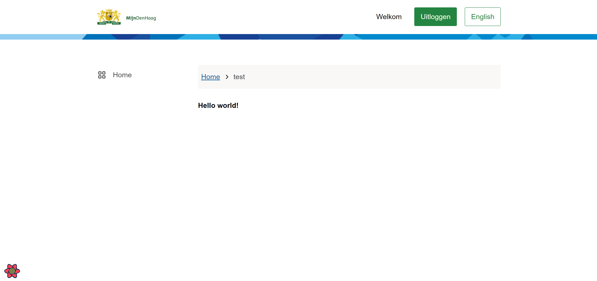
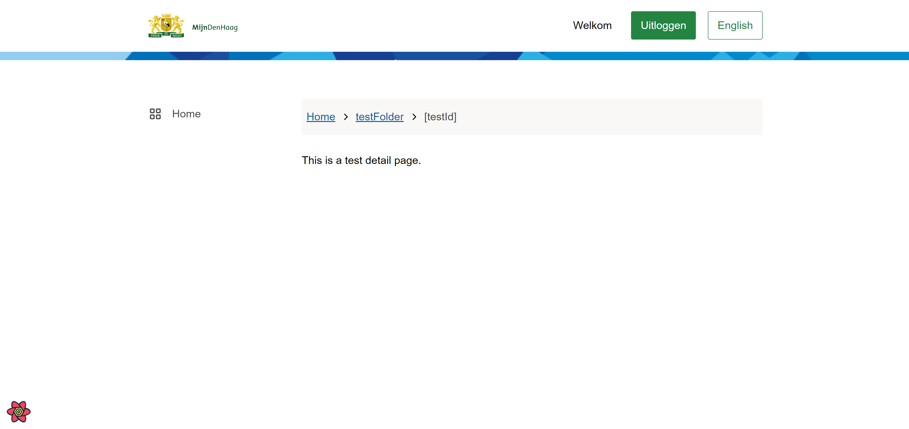
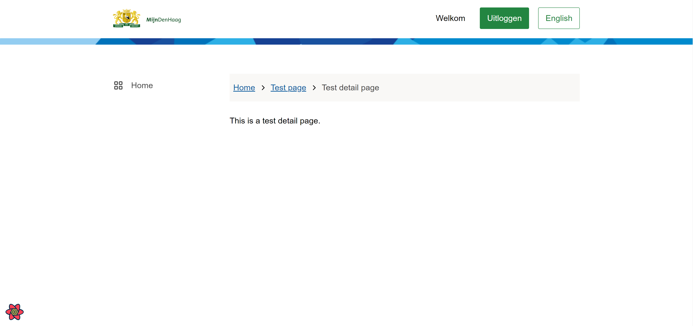

# Development of the Skeleton Application

This page consists of the following parts:

- Adding a page
- Adding a detail page

## _Adding a page_

A new page can be added with the following steps:

- Create a new file for your page under /src/pages. (The name of the file wil be the slug and will be used as a breadcrumb)
- When creating a page for the PIP-template you want to add the 'DashboardTemplate' in your page
- Then you can add a template to the page (this is not necessary but makes the code base clean and organized)
  - Create a new folder under /src/templates
  - Create a tsx file
  - Create a module.css file (if necessary)

As an example I will create a file 'test' with a template called 'testTemplate'.
The code of the 'test' file looks like this:

```TypeScript
import * as React from "react";
import { DashboardTemplate } from "../templates/dashboard/DashboardTemplate";
import { TestTemplate }from "../templates/testFolder/TestTemplate";

const TestPage: React.FC = () => {
  return (
    <DashboardTemplate>
      <TestTemplate />
    </DashboardTemplate>
  )
};

export default TestPage;
```

The code of the 'TestTemplate' file looks like this:
```TypeScript
import * as React from "react";

export const TestTemplate: React.FC = () => {
  return (
    <h4>Hello world!</h4>
  );
};
```

Now navigate to localhost:8000/test. 
You should see this: 



---

## _Adding a detail page_

A new detail page can be added with the following steps:

- Create a new folder under /src/pages (The name of this folder wil be the slug and will be used as a breadcrumb)
- Add the page you created above to the folder
- Create an index file to the folder. This wil import and export the main page
  - The code should look like this:
```Typescript
import TestPage from "./test";

export default TestPage;
```

As an example I added the test file to the folder 'testFolder'.
Now go to localhost:8000/testFolder.
You will see the same result as above. 

Now it's time to add the detail page
- Create a folder named [testId] under the testFolder (the parentheses around the name makes gatsby see this as a variable)
- Create a new file for the detail page. (same as described above)
- Create an index file with the import and export of the detail page

Now go to localhost:8000/testFolder/testDetail. (testDetail can be anything)
You should see this.



> **_NOTE_**
> The breadcrumbs will be automatically generated, but we can change this.

To change the breadcrumb you have to go to the /pwa/gatsby-config.js file
Go to the gatsby-plugin-breadcrumb block in the file. 
Under options, you can add an array crumbLabelUpdates.
Within that you can add an object with pathName and crumbLabel. 
For the pathName we can add the folder name as it is. crumbLabel will be the outcome.

Here I am editing the breadcrumbs of the pages we just created.

```Typescript
crumbLabelUpdates: [
  {
    pathname: "/testFolder",
    crumbLabel: "Test page",
  },
  {
    pathname: "/testFolder/[testId]",
    crumbLabel: "Test detail page",
  },
]
```

Restart the development server. The breadcrumbs should look like this. 



---
